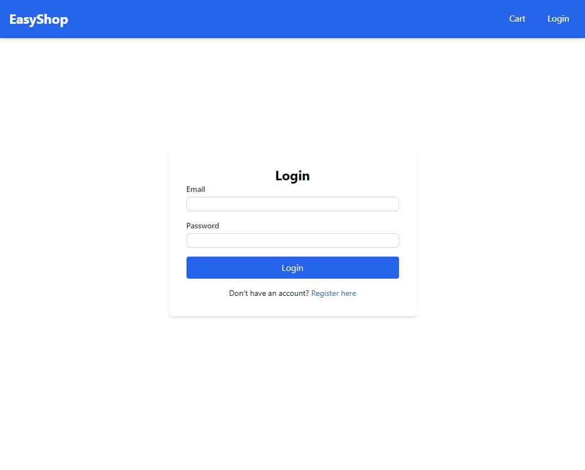
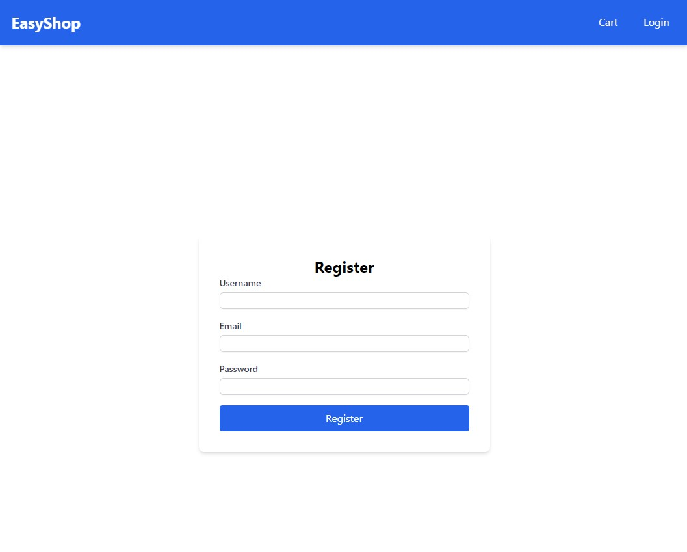
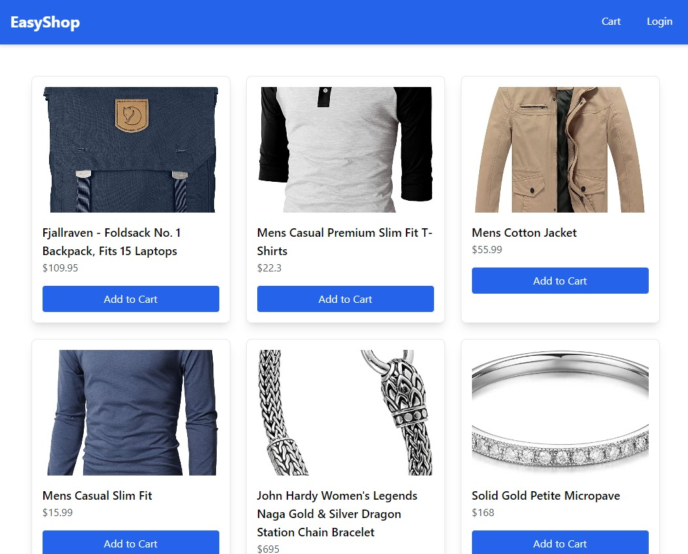
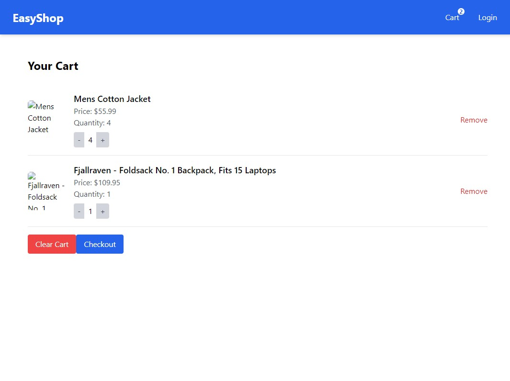

# EasyShop

### Project Module 5

#### By Ridzky Sulthan

[Link to site]()

## Dependencies

- [React](https://react.dev/) and [Typescript](https://www.typescriptlang.org/)
- [Create React App](https://github.com/facebook/create-react-app).
- [npm](https://www.npmjs.com/) to manage libraries, packages, and modules.
- Vanilla css and [Tailwind CSS](https://github.com/tailwindlabs/tailwindcss) to style the app.
- [react-router](https://reactrouter.com/en/main) to navigate and route different pages.
- [yup](https://www.npmjs.com/package/yup) to validate inputs.
- [formik](https://formik.org/) to display forms.

## Workflow

Clone repository:

```console
git clone https://github.com/revou-fsse-5/module-5-ridzkysulthan.git

cd module-5-ridzkysulthan
```

Next, start the application by running

```console
npm start
```

## App Screenshots






